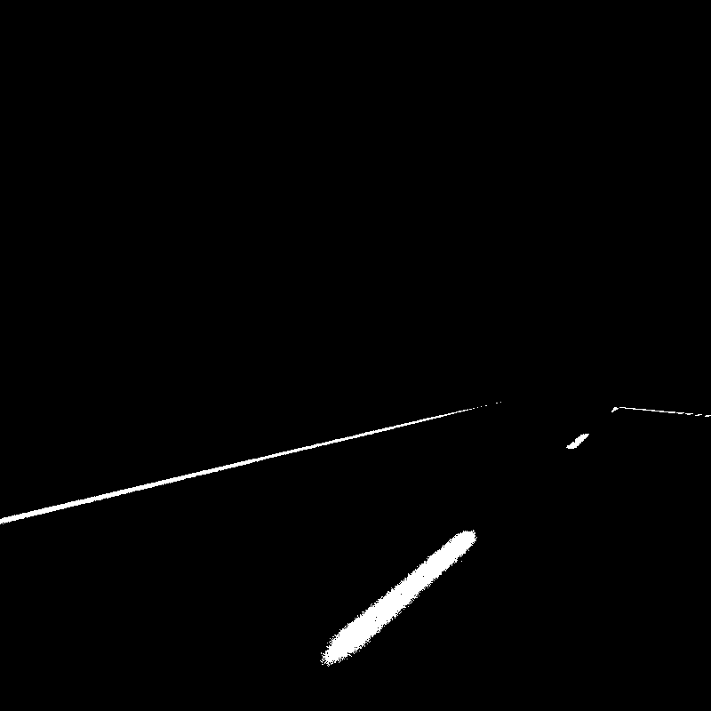

<h3 align="center">IGVC SELF DRIVE LANE DETECTION</h3>

<p align="center"> documentation
    <br>
</p>


# lane_contours.py <a name = "lane_contours"></a>

Takes the input image from the two cameras, finds contours and filters out noise. <br>
Output topics: <br>
1) Left camera - <b>/model_lanes</b> <br>
2) Right camera - <b>/model_lanes2</b> <br>
Passes the output 2 channel images to IPM. The output should look like this - 
<br><br>


# ipm_git.cu <a name = "ipm"></a>

Inputs are the contour images from the two cameras. Does IPM on all the white points and publishes to two topics - <br>
1) Left camera - <b>/ipm_left</b> <br>
2) Right camera - <b>/ipm_right</b> <br>

# image_drawer.py <a name = "image_drawer"></a>

Takes the IPM pointcloud data, and plots it on an image. Each coordinate is scaled with the formula - <br>
```
x' = (x+6)*100
y' = (y+6)*100
```
(x', y') are plotted on the image
This image is used for processing the lanes and making the 3 lines, and also detecting the horizontal line at the intersection. <br>
The image is published on <b> /lanes_draw </b>

# horiz_line.py <a name = "horiz line"></a>

This takes in the image_drawer image, and processes it. First finds all hough lines on the image. Then clusters the hough lines into 4 main groups - <br>
1) Left line
2) Right line
3) Centre dashed line (completed dash)
4) Horizontal line (if detected)

After the lines are clustered, it publishes a pointcloud message containing the 3 vertical lines. It makes the pointcloud by just doing the inverse transformation of the one done in image_drawer i.e -<br>
```
x = (x'/100)-6
y = (y'/100)-6
```

If a horizontal line is detected, we store the vertical lanes at that instant. From this point onwards, until the bot reaches the intersection, we will publish those last seen vertical lanes.
<br>
The final lanes pointcloud will be published on <b>/sd_lanes</b>
<br><br>
After the intersection is reached, we detect the horizontal line in the left and right turns respectively, and depending on where we have to turn, we plan a path from the current position to the goal (midpoint of said horizontal line).